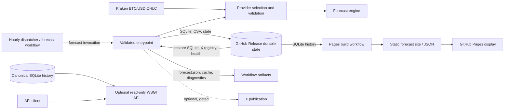

# Production forecast architecture

This page documents the production forecast contract and how its result reaches
the public display. It describes the scheduled path through
`btc_timesfm.ops.validated_entrypoints.run_forecast`; local CLI runs and research
experiments have different operational boundaries. Forecasts are experimental
estimates, not guarantees.

## System context



The static Pages site and the WSGI API are separate read paths. Pages rebuilds
HTML and static JSON from the released SQLite history. The API is an optional
authenticated service reading canonical SQLite; it is not the Pages backend.
See the [API contract](FORECAST_API_CONTRACT.md) and [API service](FORECAST_API_SERVICE.md).

## Production generation sequence

```mermaid
sequenceDiagram
  participant S as Scheduler / GitHub Actions
  participant V as validated_entrypoints.run_forecast
  participant D as Provider selection and validation
  participant H as Durable SQLite history
  participant M as TimesFM and baselines
  participant P as Postprocess and persistence
  participant R as GitHub Release
  participant X as Optional X publisher
  S->>R: Restore history and publication state
  S->>V: Invoke forecast after schedule guard
  V->>D: Fetch redundant hourly BTC/USD candles
  D-->>V: Validated provider result (fallback if needed)
  V->>H: Restore/migrate cache if applicable; read mature history
  V->>M: Load pinned CPU model and run inference
  M-->>V: Return forecasts, quantiles, baselines
  V->>P: Weight, calibrate, diagnose, reconcile horizons
  P->>H: Save rolling cache; persist forecast and mature outcomes
  P->>R: Verify/export and release durable database/state
  opt Scheduled or explicitly requested and health-gated
    P->>X: Prepare/reserve, publish idempotently, persist registry
  end
  R-->>S: Durable forecast history for future runs
```

The hourly dispatcher wakes at minute 7 and dispatches the forecast workflow
without X enabled. The forecast workflow also has a two-hour cron at minute 37;
its durable schedule guard avoids duplicate work and handles delayed runs. The
Pages workflow has its own hourly fallback at minute 17 and also rebuilds after
forecast workflow completion, on push to `main`, or manual dispatch. These are
distinct schedules: a Pages rebuild does not generate a forecast.

## Production data and model contract

1. `run_forecast` installs the production policy and instrumentation, then calls
   `btc_timesfm.cli.btc_forecast.main()`.
2. `fetch_redundant_hourly(512)` selects and validates provider data, with
   fallback and provenance diagnostics. Production uses completed hourly
   BTC/USD candles; the Kraken engine uses `XBTUSD`. At least 64 completed
   candles are required and at least 513 closes are requested so the longest
   context has 512 hourly returns.
3. The forecast origin is the timestamp of the latest completed close. The
   rolling cache (`.state/previous_forecast.json`) is bootstrapped into the
   durable store when needed. Matured outcomes and exact target timestamps from
   durable history are used for scoring, calibration, and model weighting.
4. Derivatives (including funding/open interest), microstructure (including
   order-book signals), and cross-asset (including ETH) snapshots are collected
   as optional sources. Their health and retention are recorded. Their numeric
   fields are attached to the output's `market_features` after point inference
   for diagnostics/metadata; they are **not covariates** to TimesFM or the
   production baseline forecasts. Quarantined sources are excluded from feature
   attachment. The production model input remains BTC hourly log returns.
5. TimesFM is the `timesfm[torch]==3.0.2` dependency from `pyproject.toml` and
   `uv.lock`, using checkpoint `google/timesfm-3.0-pytorch` at immutable
   revision `43046b85ec22d584a13f8098c2ed39c889e129c2`. The evaluator runs on
   CPU with per-core batch size 1. Input is a one-dimensional sequence of hourly
   log returns, `log(close[t] / close[t-1])`; inference requests 16 steps and
   quantiles with symmetric averaging disabled.
6. Available TimesFM contexts are 168, 336, and 512 hourly returns (7, 14, and
   about 21 days). Each context is forecast separately. Published target
   horizons are 2, 4, 8, and 16 hours. Returned quantiles are the nine levels
   0.1 through 0.9; the point forecast must match the median (0.5) quantile.
   Production retains Q10/Q50/Q90. For each horizon, return steps are
   accumulated and exponentiated from the latest BTC close to produce a price.
7. Persistence, seven-day drift, and AR(1) baselines forecast the same horizon
   set. Regime-aware priors are blended with leakage-guarded matured
   out-of-sample performance when sufficient history exists. Weighting has
   bounded contributions and persistence fallback behavior. The research ridge
   feature model is disabled by the production policy.
8. The ensemble is postprocessed with model disagreement, empirical Q10–Q90
   coverage calibration, direction evidence, conditional calibration,
   abstention and threshold diagnostics, and cross-horizon coherence checks.
   The published ensemble Q10/Q50/Q90 are calibrated marginal price intervals;
   they are not a joint distribution over the entire path.
9. Forecast and matured outcomes are persisted in SQLite with write-once history
   semantics. The workflow verifies and exports SQLite and CSV, creates
   compressed durable Release assets, and preserves verified rollback/independent
   backup safeguards before replacing canonical assets. X publication is
   optional and gated: scheduled runs or a manual `post_to_x` request must pass
   health and preflight checks; publication uses durable idempotency state.

### Quantiles and confidence are different

Q10/Q50/Q90 describe forecast price quantiles/interval bounds, subject to the
calibration process. The confidence section is an evidence-quality assessment
based on matured performance, calibration, sample depth, and drift; it is not
the probability that a forecast is correct. Model agreement is also not a
probability. Because per-hour marginal return quantiles are accumulated to
price targets without a modeled joint dependence structure, accumulated
marginal quantiles must not be described as true cumulative joint quantiles.

## Execution boundaries

| Mode | Purpose and contract |
| --- | --- |
| Production | `python -m btc_timesfm.ops.validated_entrypoints forecast`; production policy, validation/observability, restore and durable-history lifecycle, release workflow, optional separately gated X. |
| Local | `PYTHONPATH=src python -m btc_timesfm.cli.btc_forecast`; runs the CLI in the current working directory, so generated files and `.state/` are local. It does not itself restore/publish GitHub Release state or post to X. |
| Research | Backtests, optimizers, ablations, and challenger evaluations use experiment-specific data and policies. They are recommendation/evaluation paths, not implicit changes to production. Research may enable models such as ridge that production disables. |
| Display | Pages is a static-site rebuild from released history; the optional WSGI API is a separate read-only service over SQLite. Neither runs TimesFM inference. |

The legacy [forecast walkthrough](FORECAST_WORKS.md) is retained as archived,
implementation-era detail; this page is the production architecture and current
contract reference.

## Files and output contracts

| Path | Producer / consumer | Contract |
| --- | --- | --- |
| `forecast.json` | Forecast CLI; workflow artifact and job summary | Current forecast document: origin and provider provenance, model identity, features/regime, raw model predictions, ensemble predictions and weights, calibration/confidence/probability/coherence/abstention/attribution diagnostics, and history-store status. `predictions` has `2h`, `4h`, `8h`, `16h`, each with `price_usd`, `change_pct`, `q10_usd`, `q50_usd`, `q90_usd`, agreement/disagreement, weighting and calibration diagnostics. |
| `.state/previous_forecast.json` | CLI; restored/saved by workflow cache | Small rolling, deduplicated forecast snapshot cache (up to 72) for bootstrapping and local fallback; not the durable source of truth. |
| `.state/forecast_history.sqlite` | `ForecastHistoryStore`; release | Canonical durable forecast ledger and matured outcomes; exact target timestamps are used for matching/scoring. Released as `forecast_history.sqlite.gz`. |
| `.state/forecast_history.csv.gz` | History export; release | Portable export of durable history. |
| `tweet.txt` | CLI; formatted and optionally published | Generated textual summary; existence does not mean it was posted. X status and registry track the gated publication workflow. |
| `derivatives_signal.json`, `microstructure_signal.json`, `cross_asset_signal.json` | Optional-source collectors; workflow artifact | Snapshot and freshness/quality context, not model input covariates. |
| `source_health.json`, `drift_report.json`, `market_data_validation.json`, `market_data_source.json` | Validation/health stages; workflow artifact and summaries | Provider validation, selection, optional-source health, and drift evidence. |
| `shadow_deployment_report.json`, `shadow_deployment_summary.md` | Best-effort shadow evaluation | Research/shadow monitoring output; failures do not block the public forecast. |
| Pages `forecasts/` output | `btc_timesfm.web.static_site` after SQLite restore | Static dashboard `index.html` and machine-readable `data.json`; checked by `btc_timesfm.web.contract_validation`. Generated separately from the MkDocs documentation site. |

Workflow-only state also includes observability and pipeline-health reports,
X status/registry, and compressed shadow database. The canonical Release tag is
`forecast-history-v1`; the forecast workflow uploads a run artifact with a
seven-day retention period. For API payload details, use the linked API
contract rather than treating static-site JSON and API responses as identical.

## Implementation references

- `src/btc_timesfm/ops/validated_entrypoints.py` — production entrypoint,
  instrumentation, validation hooks.
- `src/btc_timesfm/cli/btc_forecast.py` — production orchestration and
  `forecast.json` assembly.
- `src/btc_timesfm/forecasting/forecast_engine.py` — return contexts, TimesFM
  contract, baselines, weighting, and ensemble.
- `src/btc_timesfm/forecasting/forecast_policy.py` — production/research policy
  boundary.
- `.github/workflows/forecast.yml`, `hourly-forecast.yml`, `pages.yml` —
  generation, schedule dispatch, durable release, optional publication, and
  Pages rebuild.
- `src/btc_timesfm/web/static_site.py` and
  `src/btc_timesfm/api/forecast_service.py` — distinct display/read paths.

For uncertainty interpretation, see [forecast confidence](FORECAST_CONFIDENCE.md)
and the [public dashboard](PERFORMANCE_DASHBOARD.md).
