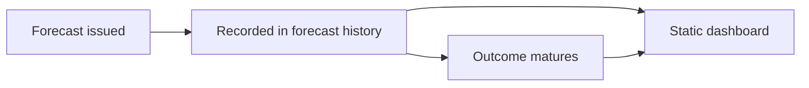

# BTC TimesFM documentation

BTC TimesFM forecasts BTC/USD prices using hourly log returns, TimesFM contexts,
and baseline models. This portal explains the forecasting system, its data,
evaluation, API, and operations.

## Start here

- [Getting started](getting-started.md) — install dependencies and run the project.
- [Forecasting](forecasting.md) — understand the forecast lifecycle, confidence, and limitations.
- [Forecast dashboard](https://jpfelgueiras.github.io/btc-timesfm/forecasts/) — browse published forecasts and matured outcomes.

## Project

- [Source code](https://github.com/jpfelgueiras/btc-timesfm)
- [Contributing](https://github.com/jpfelgueiras/btc-timesfm/blob/main/CONTRIBUTING.md)
- [Security policy](https://github.com/jpfelgueiras/btc-timesfm/blob/main/SECURITY.md)
- [Code of conduct](https://github.com/jpfelgueiras/btc-timesfm/blob/main/CODE_OF_CONDUCT.md)

Forecasts are experimental and are not financial advice. Historical accuracy
does not guarantee future results. The public dashboard is a static view of
recorded forecast history, not a live quote or the authenticated forecast API.

